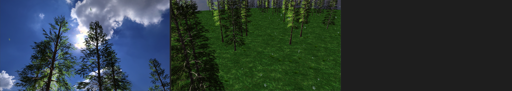
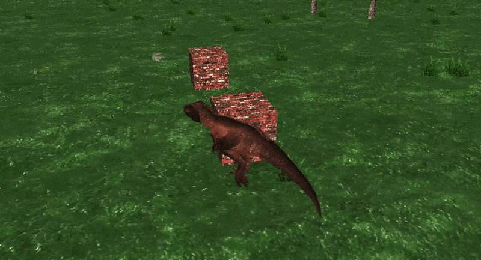
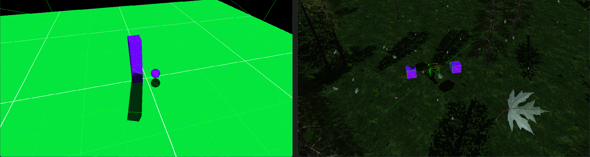

# Rasterizer

## 📌 About

This project is a custom 3D rasterizer built using **C++** and **DirectX11**, designed to explore and demonstrate core real-time rendering techniques from the ground up.

## 🚀 Features Implemented
- ✅ 3D Transformations & Projections  
- ✅ Vertex & Skeletal Animations  
- ✅ Flat Lighting  
- ✅ Deferred Rendering Pipeline  
- ✅ AABB (Axis-Aligned Bounding Box) Collision Detection  
- ✅ Third-Person Character Controller  

  
  

## 🛠️ Currently Working On
- 🌑 Shadow Mapping (Directional lights & dynamic shadows)

